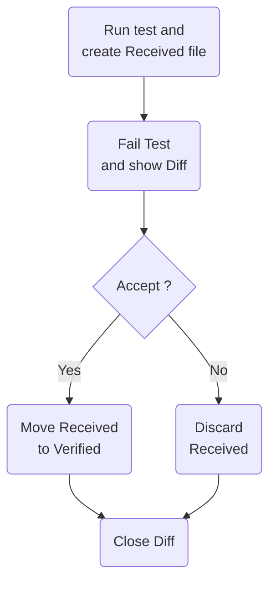
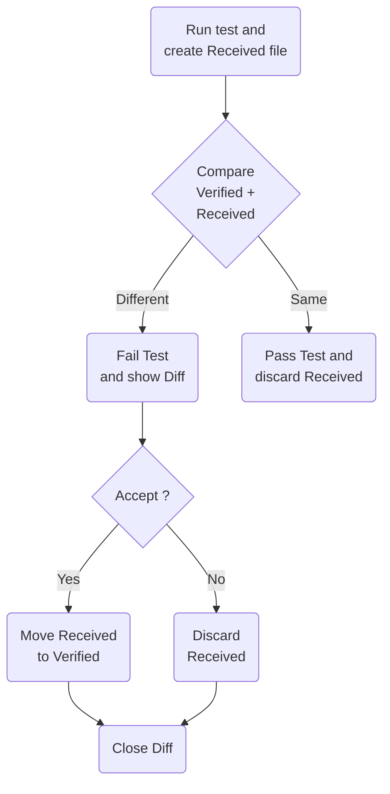

Verify works by serializing your test result to a `.received.` file and comparing it against a committed `.verified.` file. On the first run there is no verified file yet, so the test always fails initially. Once you accept the result, a `.verified.` file is created and future runs compare against it.

## Initial verification

When no `.verified.` file exists, the test run produces a `.received.` file and fails immediately. You then review the received output and decide whether to accept it.



## Subsequent verification

When a `.verified.` file already exists, Verify compares the new `.received.` output against it. The test passes if they match, and fails with a diff if they differ.



## Source control

Commit all `*.verified.*` files to source control. They are your reference snapshots and should be reviewed in code review when they change alongside the code that produced them.

Exclude `*.received.*` files — they are temporary artefacts produced during test runs and should never be committed.

Add the following to `.gitignore`:

```gitignore
*.received.*
*.received/
```

Text-based verified files use UTF-8 with BOM and LF line endings. Configure `.gitattributes` so Git preserves these settings:

```gitattributes
*.verified.txt text eol=lf working-tree-encoding=UTF-8
*.verified.xml text eol=lf working-tree-encoding=UTF-8
*.verified.json text eol=lf working-tree-encoding=UTF-8
*.verified.bin binary
```

<Note>
`working-tree-encoding=UTF-8` is correct even though Verify writes files with a BOM. Git passes the BOM through transparently. Do not use `UTF-8-BOM`, which would cause Git to strip and re-add the BOM on each round-trip.
</Note>

On Windows, if `core.autocrlf` is `true`, files may appear modified with no content changes. Fix this globally:

```bash
git config --global core.autocrlf input
```

## Conventions check

Call `VerifyChecks.Run()` in a test to validate that your repository follows the expected conventions (`.gitignore`, `.gitattributes`, etc.):

```cs
[Fact]
public Task Run() =>
    VerifyChecks.Run();
```

## Snapshot management tools

Accepting or rejecting a snapshot file is part of the core workflow. Several tools are available — choose whichever fits your setup.

<CardGroup cols={2}>
  <Card title="DiffEngineTray" icon="desktop" href="https://github.com/VerifyTests/DiffEngine/blob/main/docs/tray.md">
    Windows system-tray application. Accept or discard snapshots from a menu without leaving your editor.
  </Card>
  <Card title="ReSharper plugin" icon="plug" href="https://plugins.jetbrains.com/plugin/17241-verify-support">
    Accept snapshots directly from the ReSharper test runner inside Visual Studio.
  </Card>
  <Card title="Rider plugin" icon="plug" href="https://plugins.jetbrains.com/plugin/17240-verify-support">
    Accept snapshots directly from the Rider test runner.
  </Card>
  <Card title="Verify.Terminal" icon="terminal" href="https://github.com/VerifyTests/Verify.Terminal">
    A `dotnet` CLI tool for bulk-accepting or discarding snapshot files from the command line.
  </Card>
</CardGroup>

Additional options:

- **Clipboard** — copy the acceptance command from the test failure output and run it in a terminal.
- **Diff tool** — use the diff tool launched by Verify to copy content or click an "accept" button if the tool supports it.
- **Manual rename** — rename `.received.` files to `.verified.` on the file system. This can be scripted to bulk-accept all pending snapshots.

## AutoVerify

`AutoVerify` skips the comparison step and automatically accepts every received file as the new verified file. This is useful during initial setup or when regenerating all snapshots. See [Verify options](/verify-options) for details.
